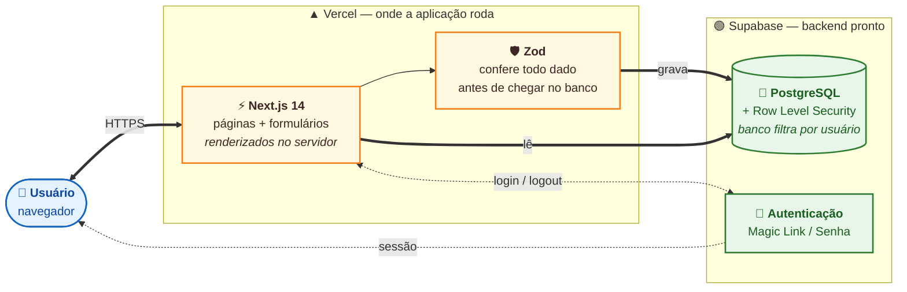
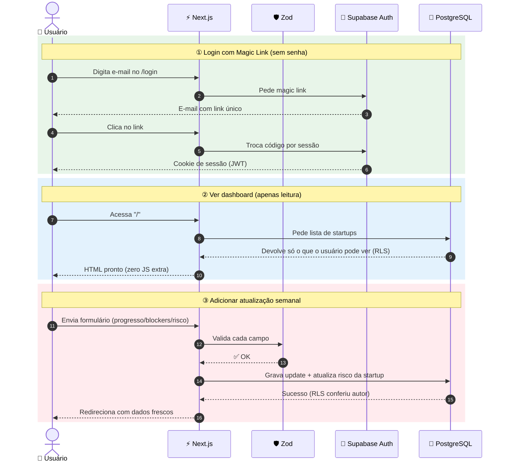
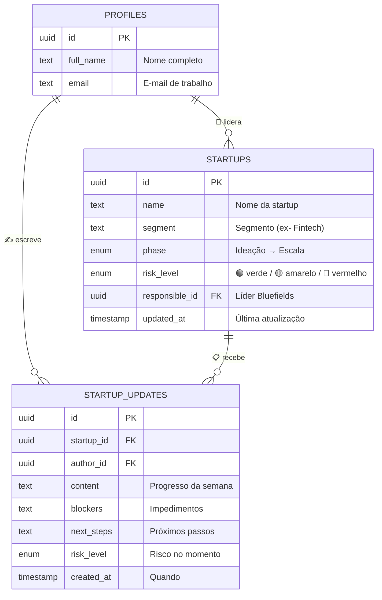

# Startup Tracker — Bluefields AI-First MVP


Plataforma profissional de acompanhamento de portfólio para aceleradoras e venture studios. Fonte única da verdade para status, risco e atualizações de startups — eliminando silos de informação espalhados em WhatsApp, e-mail e páginas de Notion.

Construído como um case técnico para a **Bluefields**, seguindo um fluxo de trabalho rigoroso de desenvolvimento AI-First.

---

## Métricas Chave

| Métrica | Valor |
|---|---|
| Custo Mensal | **R$ 0,00** (Vercel Hobby + Supabase Free) |
| Latência de Interação | < 1s (Next.js Server Actions) |
| Segurança de Tipos | **100%** (TypeScript Estrito + Zod) |
| Modelo de Segurança | Row Level Security (RLS) forçado na camada de DB |
| Código Gerado por IA | **~85%** (Claude Code + Revisão humana constante) |
| Integridade de Dados | Postgres ACID + Validação Zod |

---

## Arquitetura

```
USUÁRIO (Browser)  ──HTTPS──>  Vercel Edge (Next.js 14)  ──Server Action──>  Supabase (Postgres)
                                     |                                         |
                                Middleware                                  Política RLS
                            (Filtro de Sessão)                          (Barreira de Auth)
```

### Stack Tecnológica

| Camada | Tecnologia | Propósito |
|---|---|---|
| **Frontend** | Next.js 14 (App Router) | React Server Components para leitura rápida e SEO |
| **Estilização** | Tailwind CSS + Shadcn/UI | Sistema de design premium com branding Bluefields |
| **Autenticação** | Supabase Auth (Magic Link) | Login sem senha, seguro e de nível enterprise |
| **Banco de Dados** | Supabase Postgres | Armazenamento relacional com RLS e triggers |
| **Validação** | Zod | Guardrails em tempo de execução em todas as Server Actions |
| **Deploy** | Vercel Edge | Distribuição global com latência mínima |

### Decisões de Design Chave

| Decisão | Escolha | Por que? |
|---|---|---|
| Busca de Dados | RSC (Server Components) | Zero JS no cliente para o render inicial, FCP mais rápido |
| Segurança | RLS-only | Segurança garantida no banco; sigilo da chave do app é secundário |
| Gestão de Estado | URL-driven + Actions | Estado mínimo no cliente, comportamento nativo de forms |
| Padrão de Auth | Magic Link | Reduz atrito para gestores de portfólio; alta segurança |
| UX | Shadcn/UI | Componentes acessíveis e premium com tema customizado |

---

## Metodologia AI-First

Este projeto foi construído usando um modelo estrito de parceria IA-Humano, utilizando padrões avançados de orquestração para garantir engenharia de alta qualidade.

| Componente | Método | Impacto |
|---|---|---|
| **Workflow SDD** | Spec-Driven Development | **Abordagem Design-First.** Funcionalidades são desenhadas em `.claude/sdd/` antes de qualquer linha de código. |
| **Diagram Agent** | Visualização Automática | **Documentação viva.** Um agente especializado analisa o código para gerar e sincronizar diagramas Excalidraw automaticamente. |
| **Guardrails Zod** | Segurança de IA | **Barreira de confiança zero.** Validação automática em cada entrada para evitar "alucinações" de lógica da IA. |

---

## Modelo de Dados

### Esquema Relacional

```
                     profiles (Usuários)
                        |
        author_id <── startup_updates ──> startup_id
                                              |
                                       responsible_id
```

| Tabela | Propósito | Controle de Acesso (RLS) |
|---|---|---|
| `profiles` | Armazena metadados e nomes de usuários | Usuários Autenticados (Leitura/Edição Própria) |
| `startups` | Core do acompanhamento (nome, fase, risco) | Usuários Autenticados (Leitura/Escrita) |
| `startup_updates` | Log cronológico imutável de atualizações | Apenas o Autor (Inserção) |

---

## Diagramas

Os três diagramas abaixo respondem, nessa ordem, **"do que é feito?"**, **"como funciona em uso?"** e **"o que está guardado?"**. São renderizados nativamente pelo GitHub — basta rolar.

### 1. Arquitetura — visão geral

> Como as três camadas conversam: o usuário no navegador, a aplicação na Vercel e o backend no Supabase.



**Por que essa forma:** o usuário nunca fala direto com o banco. Toda requisição passa por uma camada que valida (Zod) antes de gravar, e o próprio banco recusa qualquer query de quem não está autenticado (RLS). Quatro camadas independentes precisam falhar para um dado vazar.

---

### 2. Fluxo de dados — três cenários reais

> Os três usos principais do sistema, em ordem cronológica. Os retângulos coloridos separam cada cenário.



**Leitura sem JavaScript no cliente** (cenário ②) e **validação dupla — Zod no servidor + RLS no banco** (cenário ③) são as duas decisões que mais reduzem superfície de bug e ataque.

---

### 3. Modelo de dados — o que é guardado

> Três tabelas. As setas mostram as relações: um perfil lidera várias startups, e cada startup recebe muitos updates.



**Imutabilidade por design:** updates são *append-only* — não há editar/apagar. O risco da startup é um espelho do último update; assim, o histórico cronológico nunca diverge do estado atual.

> Para versão técnica detalhada (com cores de RLS, fronteiras de segurança e bindings de seta), abra os arquivos `.excalidraw` em [`startup-tracker/diagrams/`](./startup-tracker/diagrams/) no [excalidraw.com](https://excalidraw.com).

---

## Estrutura do Repositório

```
bluefields-fullstack-case/
├── startup-tracker/               # Pasta Principal da Aplicação
│   ├── src/                       # Next.js App Router (Páginas e Actions)
│   ├── components/                # Componentes UI (Tema Bluefields Premium)
│   ├── lib/                       # Configurações de Supabase e Zod
│   ├── docs/                      # Documentação Técnica Detalhada
│   │   ├── PRD.md                 # 1. Documento de Requisitos (PRD)
│   │   ├── EXECUTION_PLAN.md      # 2. Plano Estratégico de Execução
│   │   ├── AI_USAGE.md            # 4. Log de Uso e Revisão de IA ⭐
│   │   └── ARCHITECTURE.md        # Deep-dive em Arquitetura Técnica
│   ├── diagrams/                  # PNGs e Fontes do Excalidraw
│   ├── scripts/                   # Scripts operacionais e de demo
│   └── .claude/skills/            # 5. Skill Reutilizável de Revisão de Código
└── .claude/sdd/                   # Rastreabilidade SDD (Brainstorm → Design)
```

---

## Primeiros Passos

### Pré-requisitos

- [Node.js 18+](https://nodejs.org)
- [Conta no Supabase](https://supabase.com)

### Configuração Rápida

```bash
# 1. Clonar e instalar
git clone https://github.com/arthurmgraf/bluefields-fullstack-case.git
cd bluefields-fullstack-case/startup-tracker
npm install

# 2. Configuração de Ambiente
cp .env.example .env.local

# 3. Iniciar Desenvolvimento
npm run dev
```

---

## Análise de Custos

| Serviço | Camada | Uso | Custo |
|---|---|---|---|
| **Vercel** | Hobby | Hospedagem App + Edge Functions | R$ 0,00 |
| **Supabase DB** | Free | 500MB Postgres | R$ 0,00 |
| **Supabase Auth** | Free | Até 50k MAU | R$ 0,00 |

**Total: R$ 0,00/mês.** Utilizando camadas gratuitas permanentes para operações de nível enterprise sem custo.

---

## Índice de Entregáveis do Case

| # | Entregável (case Bluefields) | Localização |
|---|---|---|
| 1 | **PRD** | [`docs/PRD.md`](startup-tracker/docs/PRD.md) |
| 2 | **AI-Plan** (decomposição + plano + uso de IA) | [`docs/AI-PLAN.md`](startup-tracker/docs/AI-PLAN.md) → consolida [`EXECUTION_PLAN.md`](startup-tracker/docs/EXECUTION_PLAN.md) + [`AI_USAGE.md`](startup-tracker/docs/AI_USAGE.md) |
| 3 | **Repositório** (frontend + backend + setup) | [`startup-tracker/`](startup-tracker/) |
| 4 | **Deploy público** | [Demo Ao Vivo](https://bluefields-fullstack-case.vercel.app) |
| 5 | **Architecture** | [`docs/ARCHITECTURE.md`](startup-tracker/docs/ARCHITECTURE.md) |
| 6 | **Quality Review Skill** | [`docs/QUALITY-REVIEW-SKILL.md`](startup-tracker/docs/QUALITY-REVIEW-SKILL.md) → arquivo canônico em [`.claude/skills/code-review/SKILL.md`](startup-tracker/.claude/skills/code-review/SKILL.md) |
| 7 | **Review (auto-avaliação)** | [`docs/REVIEW.md`](startup-tracker/docs/REVIEW.md) |

---

## Autor

**Arthur Maia Graf**

[LinkedIn](https://linkedin.com) | [GitHub](https://github.com/arthurmgraf)
