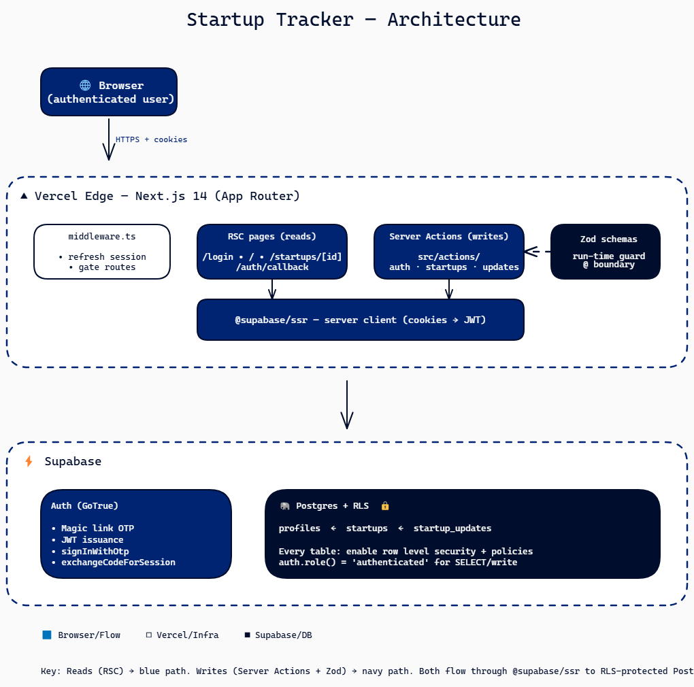
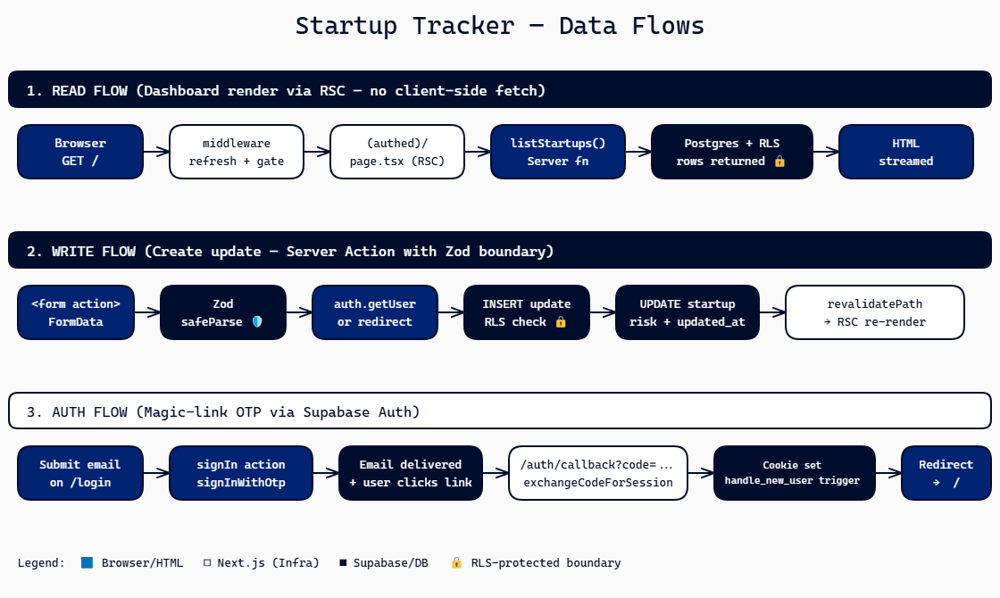
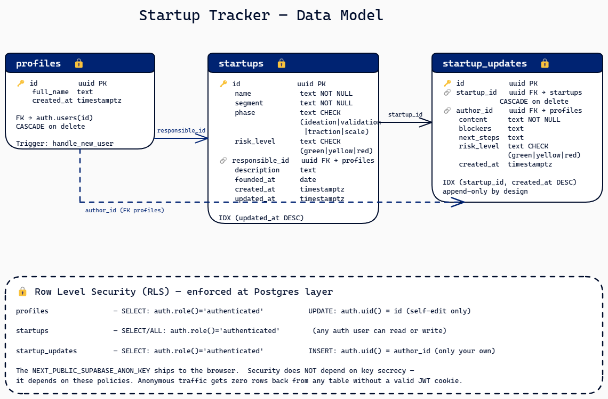

# Startup Tracker 🚀

> **Live Demo:** [https://bluefields-fullstack-case.vercel.app](https://bluefields-fullstack-case.vercel.app)
> **Stack:** Next.js 14 · Supabase · TypeScript · Tailwind · Shadcn/UI · Zod

Um MVP de acompanhamento de portfólio para aceleradoras e venture studios. Uma única fonte da verdade para o status, risco e atualizações de startups — substituindo a dispersão de informações entre WhatsApp, e-mail e Notion que a maioria dos investidores em estágio inicial utiliza.

---

## 📋 O que o projeto faz

- **Dashboard** — Visualização de cada startup em um card; badge de risco, fase atual e última atualização à mostra.
- **Vista Detalhada** — Metadados por startup, histórico completo de atualizações e formulário inline para novas entradas.
- **Rastreamento de Risco** — Níveis de risco `verde / amarelo / vermelho` em cada atualização, refletidos automaticamente na startup pai.
- **Autenticação** — Login via Magic Link pelo Supabase Auth (sem senhas).
- **Segurança** — Row-Level Security (RLS) em todas as tabelas; o acesso anônimo não permite leitura nem escrita.
- **Performance** — Páginas construídas como React Server Components; dados buscados no lado do servidor.
- **Type-safe** — Zod em todos os limites de Server Actions; zero uso de `any` no código.

---

## 🎨 Diagramas de Arquitetura

Abaixo estão os diagramas que explicam o funcionamento técnico da aplicação:

### 1. Arquitetura do Sistema
Exclica a visão macro: Navegador → Vercel Edge (Next.js) → Supabase (Auth + Postgres com RLS).


### 2. Fluxo de Dados
Detalha os fluxos de Leitura (RSC), Escrita (Server Actions com Zod) e Autenticação (Magic Link).


### 3. Modelo de Dados (ER)
Esquema das tabelas `profiles`, `startups` e `startup_updates` com chaves estrangeiras e políticas de RLS.


> *Nota: Os arquivos originais em formato Excalidraw estão na pasta [`diagrams/`](./diagrams/).*

---

## 🚀 Início Rápido

```bash
# 1. Instalar dependências
npm install

# 2. Configurar variáveis de ambiente
# Copie o template e preencha com suas credenciais do Supabase
cp .env.example .env.local

# 3. Rodar as migrações no seu projeto Supabase
# Copie o conteúdo de: supabase/migrations/001_initial_schema.sql
# Cole no SQL Editor do Supabase e clique em Run.

# 4. Rodar o projeto localmente
npm run dev
# → Acesse http://localhost:3000/login
```

---

## 🛠️ Estrutura do Projeto

```
startup-tracker/
├── src/
│   ├── app/                       # Next.js App Router (Páginas e Rotas)
│   ├── actions/                   # Server Actions (Lógica de Mutação)
│   ├── components/                # Componentes UI e Shadcn
│   └── lib/                       # Configurações de Supabase, Zod Schemas e Utils
├── supabase/
│   ├── migrations/                # Schema do Banco de Dados
│   └── seed.sql                   # Dados de exemplo
└── docs/                          # Documentação detalhada (PRD, Arquitetura, etc)
```

---

## 📖 Documentação Detalhada

| Documento | Conteúdo |
|-----|---------------|
| [`docs/PRD.md`](docs/PRD.md) | Problema, personas, histórias de usuário (MoSCoW) e critérios de aceitação. |
| [`docs/ARCHITECTURE.md`](docs/ARCHITECTURE.md) | Decisões de design, fluxo de dados e modelo de segurança. |
| [`docs/AI_USAGE.md`](docs/AI_USAGE.md) | Registro do uso de IA: prompts, erros pegos e workflow assistido. |
| [`docs/EXECUTION_PLAN.md`](docs/EXECUTION_PLAN.md) | Registro de horas de desenvolvimento e retrospectiva. |

---

## ⚖️ Regras de Código (Inegociáveis)

1. **Zero `any`** — TypeScript em modo estrito.
2. **Zod em todas as Server Actions** — validação em tempo de execução.
3. **RLS em todas as tabelas** — segurança forçada no banco de dados.
4. **Server Components por padrão** — `'use client'` apenas quando necessário.
5. **`revalidatePath` após cada mutação** — disciplina de invalidação de cache.

---

## 📄 Licença

MIT — sinta-se à vontade para adaptar.
