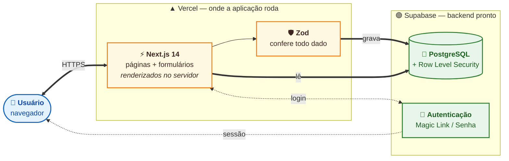
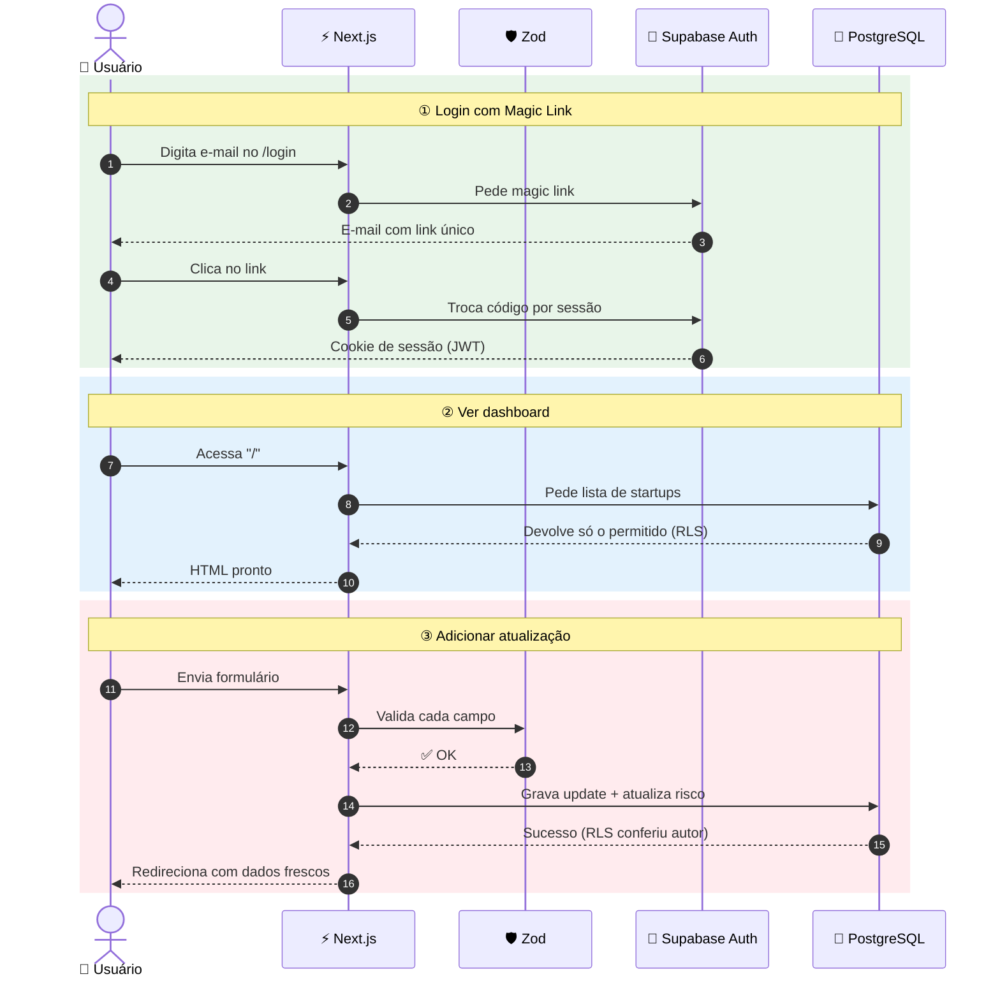
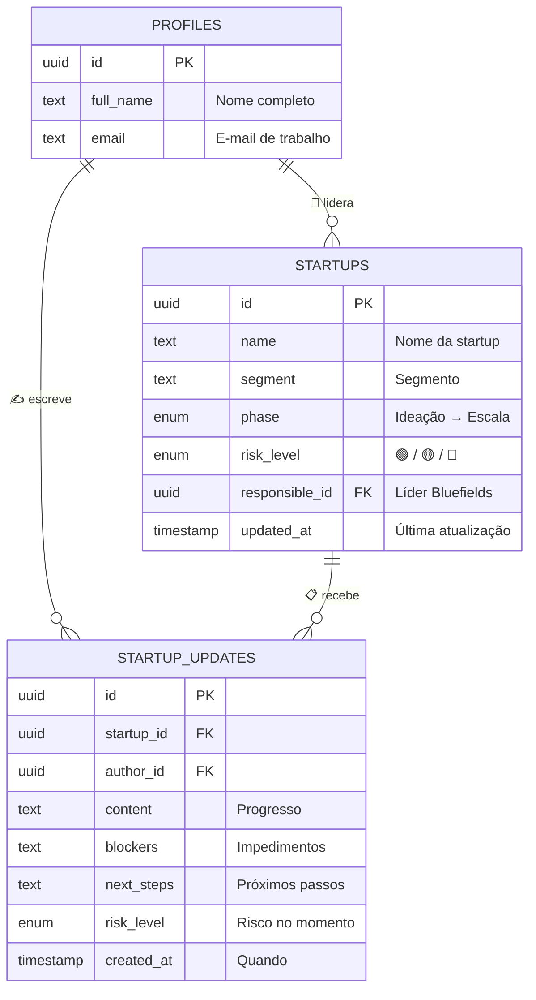

# Startup Tracker 🚀

Plataforma profissional de acompanhamento de portfólio para aceleradoras e venture studios. Fonte única da verdade para status, risco e atualizações de startups — eliminando silos de informação espalhados em WhatsApp, e-mail e páginas de Notion.

Construído com Next.js 14, Supabase (Postgres + RLS) e guardrails forçados por Zod.

---

## Métricas Chave

| Métrica | Valor |
|---|---|
| Custo Mensal | **R$ 0,00** (Vercel Hobby + Supabase Free) |
| Latência de Interação | < 1s (Next.js Server Actions) |
| Segurança de Tipos | **100%** (TypeScript Estrito + Zod) |
| Modelo de Segurança | Row Level Security (RLS) forçado na camada de DB |

---

## Metodologia AI-First

| Componente | Método | Impacto |
|---|---|---|
| **Workflow SDD** | Spec-Driven Development | Abordagem Design-First (Brainstorm → Define → Design → Build). |
| **Diagram Agent** | Visualização Automática | Análise do código para gerar diagramas Excalidraw profissionais. |
| **Guardrails Zod** | Segurança de IA | Validação automática em runtime para evitar desvios de lógica. |

---

## Stack Tecnológica

| Camada | Tecnologia | Propósito |
|---|---|---|
| **Frontend** | Next.js 14 (App Router) | React Server Components para leitura ultra-rápida |
| **Estilização** | Tailwind CSS + Shadcn/UI | Design system premium com branding Bluefields |
| **Autenticação** | Supabase Auth (Magic Link) | Login seguro sem senha nível enterprise |
| **Banco de Dados** | Supabase Postgres | Armazenamento relacional com RLS e triggers |
| **Validação** | Zod | Guardrails em cada Server Action |

---

## Diagramas

Renderizados nativamente pelo GitHub. Versão técnica em Excalidraw em [`./diagrams/`](./diagrams/).

### 1. Arquitetura — visão geral



### 2. Fluxo de dados — três cenários reais



### 3. Modelo de dados — o que é guardado



---

## Primeiros Passos

```bash
# 1. Instalar dependências
npm install

# 2. Configuração de Ambiente
cp .env.example .env.local

# 3. Configuração do Banco
# Execute a migração no SQL Editor do Supabase:
# cat supabase/migrations/001_initial_schema.sql

# 4. Iniciar Desenvolvimento
npm run dev
```

---

## Documentação

Detalhamento técnico completo disponível na pasta `/docs`:

| Documento | Descrição |
|---|---|
| [PRD](docs/PRD.md) | Problema, histórias de usuário e critérios de aceitação. |
| [Arquitetura](docs/ARCHITECTURE.md) | Modelo de segurança, fluxo de dados e stack técnica. |
| [Uso de IA](docs/AI_USAGE.md) | Log do processo de pair programming humano-IA. |
| [Plano de Execução](docs/EXECUTION_PLAN.md) | Cronograma e retrospectiva. |
